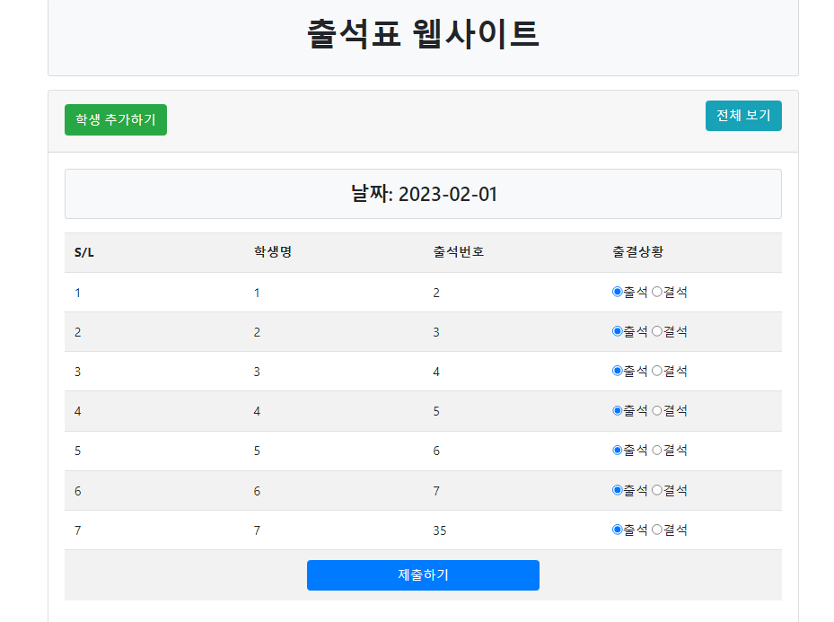
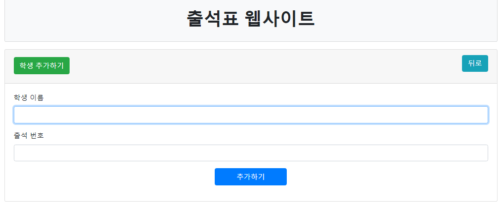

# 출석표 웹사이트

출석표 웹사이트는 MYSQL을 데이터베이스와 연동하여서 SQL문을 활용하여 사용자가 데이터 코드를 직접적으로 수정하지 않고 편리하게 코드를 수정할 수 있는 출석표 웹사이트입니다. 여러 기능을 활용하여 출석을 확인해야 하는 곳에서 유용하게 사용할 수 있습니다.

## 개발 동기

저는 학교에 다니면서 여러가지 불편해보이는 점들이 있었습니다. 그 중에서 출석부가  매우 불편해 보여서 그 단점을 최소화하고 장점을 최대한 늘려본 출결표 웹사이트를 만들어 보았습니다. 

기존의 출결표는 여러가지 단점들이 있었습니다.

+ 촘촘하게 이루어진 출결 확인 칸 (선생님들께서 학생들의 출결 상황 표기시에 실수 유발 가능)
+ 변동된 학생의 출결 상황을 실시간으로 정보 수정 못함
+ 여러명의 선생님들께서 동시에 출석부를 사용을 못하는 점

이러한 단점을 줄이고 출석부보다 더 효율성이 좋은 출결표 웹사이트를 만들기 위하여 기능을 추가하였습니다.

1. 한 학년 중에 학생이 전학을 가거나 오면 학생 정보를 수정 가능하도록 함
2. 선생님들의 표기 편의성을 위하여 기본적으로 모든 학생은 출석임. (결석한 학생만 결석으로 바꾸면 됨)

## 설치 방법

1. Apache, PHP, MySql을 지원하는 서버를 만듭니다.
2. 코드를 다운 받은 후 웹서버의 홈디렉토리에 넣습니다.
3. Sql문을 돌려서 Database를 생성합니다.
4. 인터넷 창에 localhost를 쳐서 웹사이트에 접속합니다.

##  사이트 이용 방법

출결표 웹사이트 이용 방법입니다. 

위 사진은 출결표 웹사이트에 들어갔을 때 보이는 화면입니다. 

1. 학생의 출결 관리

   모든 학생의 출결 상황은 출석으로 되어 있습니다. 하지만 학생이 결석했을 경우에는 해당 학생의 출결 상황에서 결석 옆에 있는 작은 원에 체크하시고 제출하기를 누르시면 학생의 출결상황이 결석으로 업데이트됩니다.

2. 학생 추가하기

   한 학년 중에 새로운 학생이 전학을 올수도 있습니다. 그럴 경우에는 학생을 추가하는 작업을 해주시면 됩니다. 위에 보이시는 학생 추가하기 버튼을 누르셔서 들어가시면 아래의 사진 처럼 화면이 보일 것입니다.

사진에서 해당 입력 칸에 맞는 정보를 입력해주시고 추가하기를 누르시면 학생이 추가가됩니다. 이 화면에서 '뒤로' 버튼을 누르시면 다시 웹사이트에 처음 접속했을 때의 화면으로 돌아갑니다.

3. 전체 보기

   웹사이트에 접속했을 때 보이는 화면에서 전체보기를 클릭하시면 제출하기 버튼을 통해서 업데이트 되었던 학생의 출결상황을 볼 수 있습니다. 날짜도 기록되어있어서 해당 학생이 어느 날에 결석하였는지 확인할수 있습니다. 업데이트 된 정보에 오류가 있을 시에는 보기 버튼을 눌러서 수정한 후에 업데이트 버튼을 눌러서 잘못된 학생의 출결 정보를 수정할 수 있습니다. 

#### 코드의 원저작자

https://www.facebook.com/promahmudul

